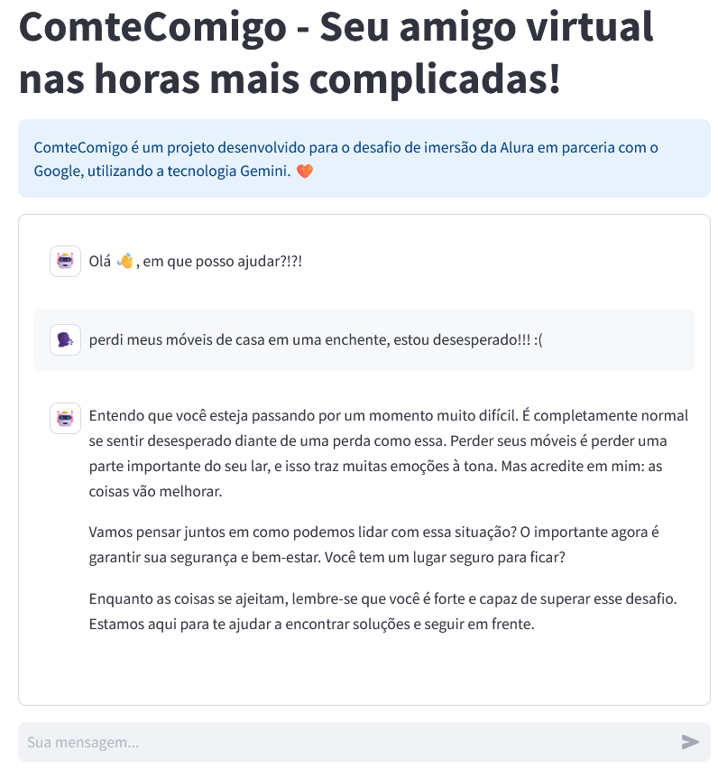
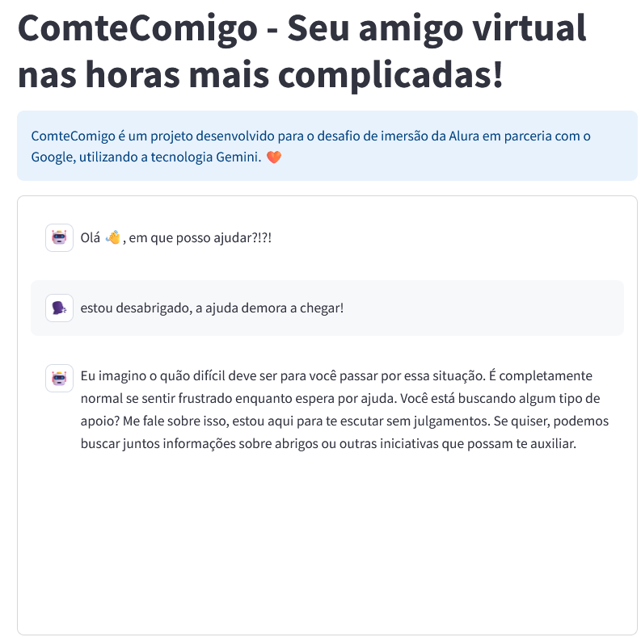
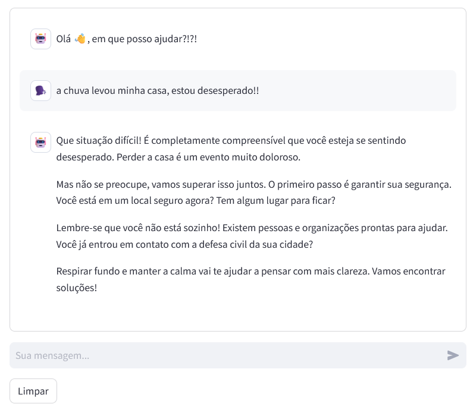
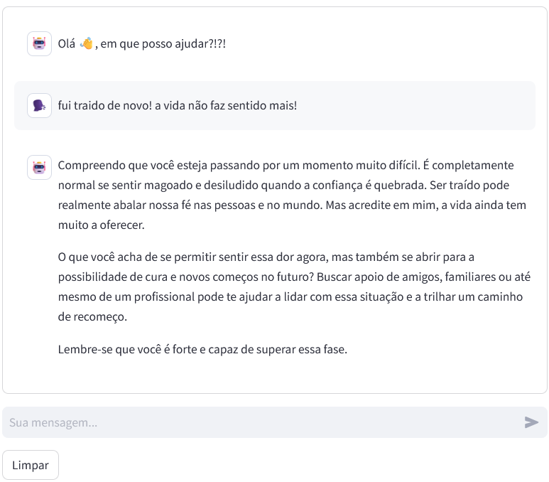

# comtecomigo
Repo do projeto de imersão da Alura com Gimini.
### Motivação

O mundo é um lugar muito difícil; já temos muitas coisas ruins acontecendo. Faz-se necessário trazer luz sempre que possível.
Com as catástrofes recentes no RS, muitas pessoas estão enfrentando problemas extremos, e o sofrimento está longe de acabar. 
O intuito do projeto é simplesmente oferecer algum apoio na impossibilidade de contato humano.
Uma palavra dita na hora certa, uma lembrança, a atenção, pode salvar vidas e dar forças a quem tanto precisa.

### Objetivo - Primario

Desenvolver um assistente virtual capaz de interagir de forma positiva com o usuário.
O assistente operará semelhante a um terapeuta e guia espiritual ( não deverá caracterizar nenhuma religião).
Será capaz de analisar a conversa com os usuários, e deverá retornar uma resposta positiva ou neutra, baseado no conteudo fornecido.

### Objetivo - Secundário

Trazer a esperança das pessoas que passam por algum trauma ou dificuldade recente.
Auxiliar nas tomadas de decisão do usuário quanto a ações potencialmente danosas, preservando a vida.
Simular apoio emocional ( na impossibilidade do humano), quando se fizer necessário.
* ***A I.A jamais deverá substituir as relações humanas!***

### Sobre

Comtecomigo é um projeto utilizando tecnologia de i.a generativa (Google Gemini).
**Comte**comigo -> Por causa do filósofo do positivismo Auguste **Comte** -> https://brasilescola.uol.com.br/sociologia/auguste-comte.htm .
**Positivismo** -> https://mundoeducacao.uol.com.br/sociologia/positivismo.htm .

### Instalação

Necessário python 3.10 +

pip install -r requirements

### Execução

Executar no terminal (mesmo diretório onde o arquivo main.py se encontra) : streamlit run main.py

### Funcionamento

